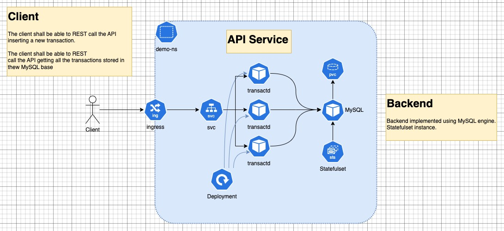

# Blockdaemon Technical Assessment

The current Proof of Concept (POC) demo will showcase a containerized Golang API service solution. 
The objective of this POC is to design and implement the service while ensuring it is reliable, observable, and scalable.

## API: Transaction records

Sample and format:

```shell
   curl --header "Content-Type: application/json" \
-X POST http://<fqdn>api/models/ \ --data '{"transactionId":"0f7e46df-c685-4df9-9e23-e75e7ac8ba7a","amount": "99.99" ,"timestamp":"2009-09-28T19:03:12Z"}'
```

## The API Service 

The API service is a `Golang` web application, using the version 1.22. More information about the service project and 
specific implementation details can be found [here](./api/README.md). 
The API will insert a new transaction in the following format:

```json
{
  "transactionId": "<UUID format>",
  "amount": "<Float format>",
  "timestamp": "<String format>"
}
```
The transaction records should be persisted in a database. For this POC demo, the engine of choice was the `MySQL`.
It is an opensource engine, with a good community support. This POC has a considerable low workflow request.

## Kubernetes Orchestration Deployment

The POC uses the _kubernetes_ (K8S) orchestrator. The deployment is powered by Helm charts. More implementation details
can be found [here](./k8s/README.md). The overall architecture:



The service is exposed using an `ingress` routing the incoming requests accordingly. The `FQDN` used is:

* test.transaction.service

There is an additional complexity to configure the `ingress`, it depends on the k8s flavour and the service architecture.
The POC development was based on a local vanilla version of `minikube`.

## Issues During the K8S Deployment

Issues to investigate. The application does not have a proper probe, this can be a sensitive issue. the backend
misses the usage too. When the chart is deployed, the service pod keeps restarting 3 times, before to 
stabilize the service. More adjusts on the probes is necessary and also an improvement at the backed side capacity
of receiving healthy requests.

## Performance Testing
Missed point in the POC.

## CI/CD
Missed point in the POC.

## Vault: Storing Secrets and Sensitive Data

Missed point in the POC