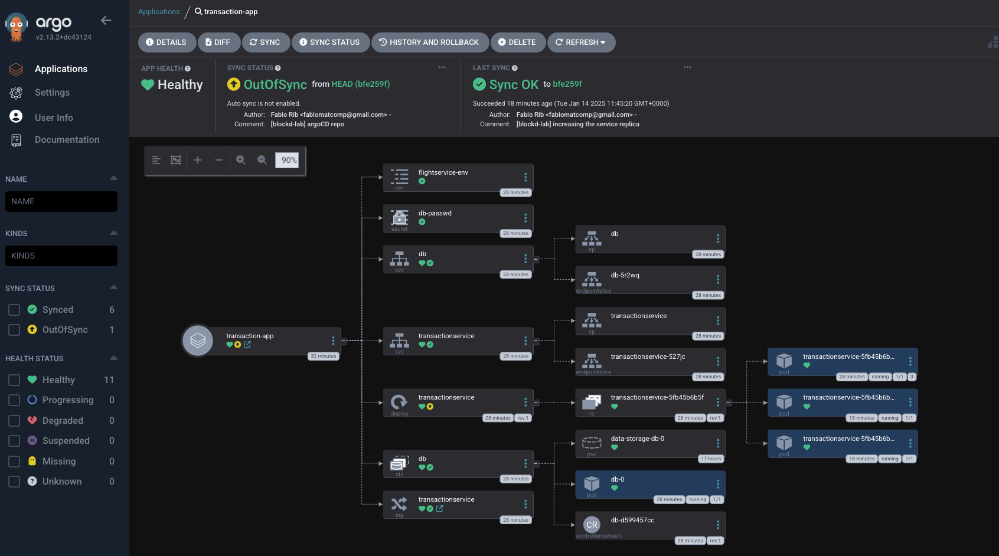

## CI/CD ArgoCD

Steps followed to configure locally the `argoCD`.
The argoCD repository for this demo: https://github.com/fabioar87/blockd-service-deployment

## Steps to Install ArgoCD

Given the time sensitivity, `argoCD` was installed following an out-of-the box step. In summary, my host environment:
1. OS: MacOSX
2. K8S implementation: Minikube

Steps to install argoCD:
```shell
# creating the argocd namespace
$ kubectl create -f namespace.yaml
$ kubectl apply -n argocd -f https://raw.githubusercontent.com/argoproj/argo-cd/stable/manifests/install.yaml
```
Enabling LB access in the Minikube:
```shell
$ minikube tunnel
```
Installing the argoCD CLI:
```shell
$ brew tap argoproj/tap
$ brew install argoproj/tap/argocd
```

Getting the host and port information:
```shell
$ minikube service argocd-server -n argocd --url
```

Login for the fist time and changing password:
```shell
$ argocd login 92.168.64.3:30899
$ argocd account update-password
```

## Interacting with argoCD

In this POC, the service has been deployed manually, and further result was visualized using the argoCD UI:
. 

It is possible also, define a new app to be deployed, and sync with the main repo using the UI.

## Production Considerations

Traditionally, deployment steps are scripted within the CI pipeline.
However, this requires the CI server to have access to the production environment, introducing a potential security risk.
To address this, Argo CD offers a feature called resource hooks.
These hooks enable the execution of custom scripts—typically packaged as Pods or Jobs—within the Kubernetes cluster during the synchronization process.